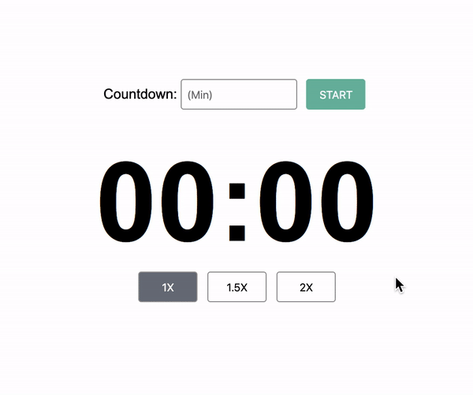

# Countdown Timer Application

 

A countdown timer in React Native with controls to add time, speed up / slow down the countdown, pause and resume

## Requeriments

- [x] The user should be able to enter a # of minutes (positive integer) and click a “Start” button to initialize the countdown.
- [x] Timer format: MM:SS
- [x] The user should be able to pause & resume the countdown using pause/resume
      buttons.
- [x] While the countdown timer is active, the user should be able to speed up / slow
      down the speed at the following rates: -- 1.0X (normal speed, selected by
      default) -- 1.5X -- 2X
- [x] When half of the selected duration has been passed, display a string of text
      above the countdown timer reading: “More than halfway there!”
- [x] When the countdown timer reaches 0, this text should change to: “Time’s up!”
- [x] When the countdown is within 20 seconds of ending, the countdown timer text
      should turn red.
- [x] At 10 seconds, the text should start blinking.
- [x] Include unit testing for applicable functionality.
- [x] The countdown timer functionality should be appropriately divided into well-
      defined components.
- [x] The look of the countdown timer should have a production-ready clean/modern
      aesthetic. Feel free to creatively stylize the elements.
- [x] Play a sound as the timer ends.

## How to start

First, you have to install all dependencies, just run `yarn` at project folder a single time

Then you can run the project with the command:

`yarn dev`

## How to test

To test the project just run `yarn test`
